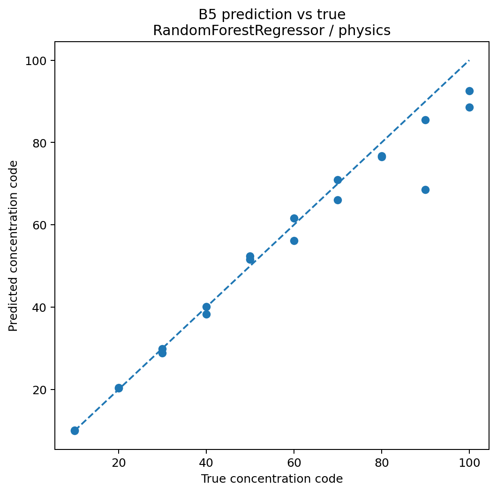
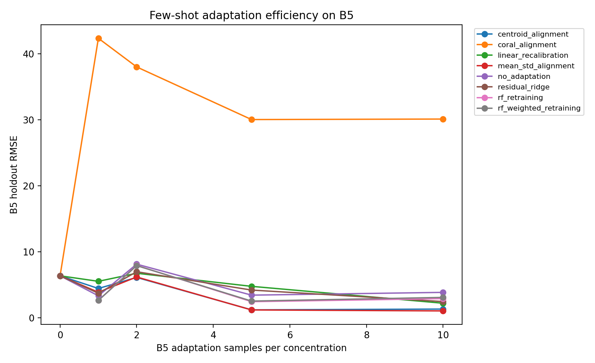
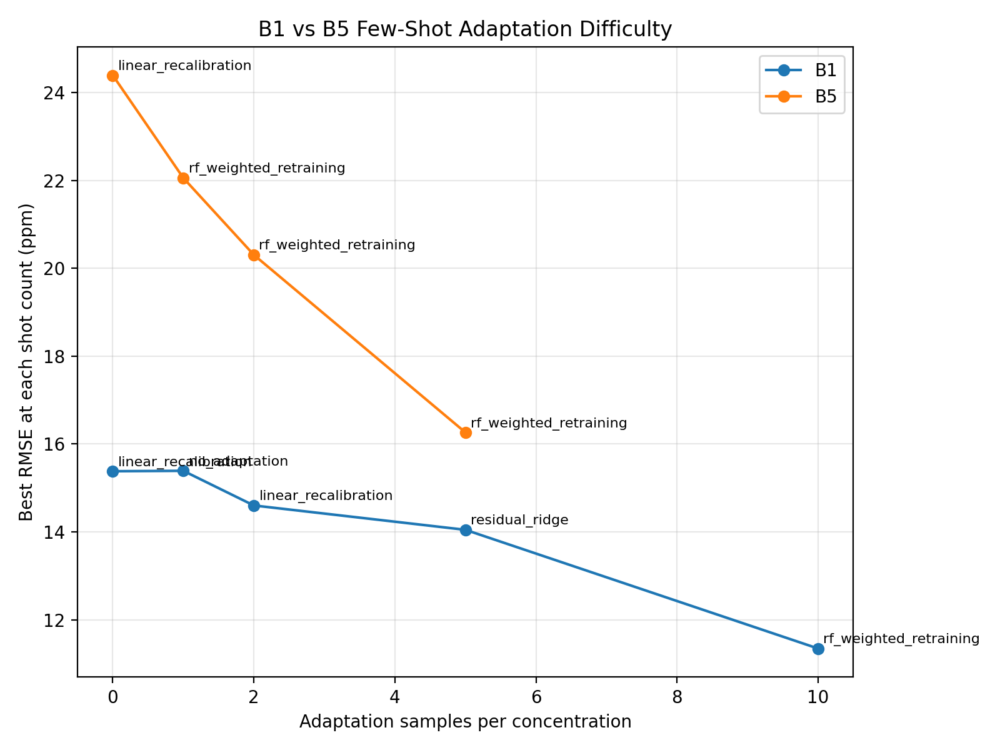
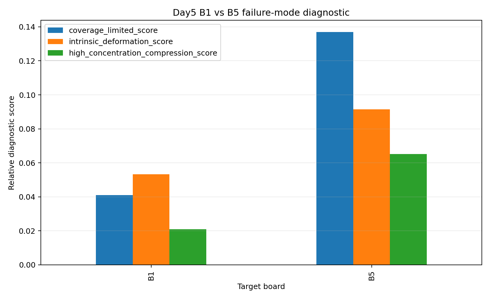

# MOx Calibration Transfer for Combustible Gas Detection

**Cross-board generalization, few-shot adaptation, and failure-mode analysis  
for metal oxide sensor arrays on the UCI Twin Gas Sensor Arrays dataset**

---

## Research Highlights

> **Not all calibration transfer failures are the same — and the remedy depends on the mechanism.**

| | |
|---|---|
| 🎯 **B5 few-shot recovery** | >80–90% RMSE reduction with a handful of labeled target points |
| ⚠️ **B1 resistance** | Only ~27% RMSE reduction; systematic response compression persists after adaptation |
| ⚛️ **Physics-informed features** | R² = 0.957 vs 0.921 for raw features — same board, same zero-shot conditions |
| 📐 **Simple beats complex** | Global mean/std alignment outperforms physics-aware piecewise corrections at realistic calibration budgets |
| 🔍 **Two failure modes** | Coverage-limited transfer (B5) vs. target-intrinsic compression (B1) — distinct causes, distinct remedies |
| 🧹 **Label leakage caught** | Discovered, diagnosed, and corrected mid-study; corrected results form the basis of all conclusions |

---
## Why This Project Matters

Most calibration transfer studies report whether transfer works.
This project investigates why transfer fails.
The result is a practical failure-mode taxonomy that links machine learning performance to underlying sensor behavior.
---
## Quick Summary

Five physically independent MOx sensor boards. Four combustible gases. One core question: can a calibration model trained on some boards transfer reliably to a board it has never seen?

This study answers that question — and finds that transfer failures are not all the same. Board B5 failed because the source domain did not cover its feature space; a handful of labeled calibration points reduced its RMSE by more than 80–90%. Board B1 failed for a different reason: systematic response compression at high methane concentrations (~−25 ppm signed error at 100 ppm) that persisted even after adaptation. Two boards, similar transfer metrics, completely different physical causes, completely different engineering remedies.

Physics-informed features (normalized Rs/R₀ ratios, response-magnitude descriptors) outperformed raw sensor values across all transfer scenarios. Simple global mean/std alignment outperformed complex piecewise corrections under realistic small-calibration-set conditions. A label leakage issue discovered mid-study was caught, diagnosed, and corrected — the corrected results are materially different and form the basis of all conclusions.

The project is eight experimental phases, eleven notebooks, and one clear practical recommendation:

> **Classify the failure mode before choosing a remediation strategy.**

---

## Key Results

| Finding | Result |
|---|---|
| B5 few-shot adaptation | RMSE reduced >80–90% with a handful of target calibration points |
| B1 few-shot adaptation | Only ~27% RMSE reduction; response compression persists |
| Physics-informed features | R² = 0.957 vs 0.921 for raw features (Board 5, zero-shot) |
| B5 zero-shot baseline | RMSE = 5.94 ppm, R² = 0.957 (XGBoost, physics features) |
| B1 zero-shot baseline | RMSE ≈ 15.4 ppm; signed error reaches −25 ppm at 100 ppm |
| B5 best few-shot | RMSE ≈ 1–2 ppm, R² > 0.99 (1-shot, mean/std alignment) |
| B1 best few-shot | RMSE ≈ 11.3 ppm (10-shot, RF weighted retraining) |
| Physics-aware correction | Did not consistently outperform simple mean/std alignment |
| Main conclusion | Calibration transfer failures arise from multiple distinct mechanisms |

---

## Visual Results

### Figure 1 — Transfer Failure Emerges on Board B5



*Zero-shot calibration transfer to Board B5 using physics-informed features. XGBoost with Rs/R₀ descriptors achieves R² = 0.957 at zero adaptation cost — establishing the ceiling for source-only transfer.*

---

### Figure 2 — Few-Shot Adaptation Dramatically Reduces B5 Error



*Few-shot adaptation on Board B5: RMSE collapses by >80–90% within the first few labeled target samples. Mean/std alignment (orange) is the dominant strategy — simple, robust, and not outperformed by more complex corrections.*

---

### Figure 3 — B1 and B5 Respond Differently to Adaptation



*B5 is highly recoverable with few-shot adaptation; B1 remains difficult across all methods and sample counts. This divergence motivated a formal mechanistic investigation, confirming two qualitatively distinct failure modes.*

---

### Figure 4 — Failure Mode Taxonomy (Day 5 Synthesis)



*Calibration transfer failures are not a single phenomenon.
Board B5 exhibits a coverage-limited failure mode and is highly recoverable.
Board B1 exhibits a target-intrinsic compression failure mode and remains difficult even after adaptation.*

---

## Overview

Metal oxide (MOx) gas sensors degrade in reproducibility when deployed across multiple physically distinct sensor boards. Even within a single sensor batch, board-to-board variation in baseline resistance, response gain, and recovery dynamics can render a model trained on one board unreliable when applied to another. This is the **calibration transfer problem**.

This project investigates calibration transfer for combustible gas detection (methane focus) using the [UCI Twin Gas Sensor Arrays dataset](https://archive.ics.uci.edu/dataset/361/twin+gas+sensor+arrays), a controlled benchmark with five independent sensor boards and four combustible gases. The work progresses from a zero-shot baseline through few-shot adaptation and physics-aware correction, culminating in a structured failure-mode analysis that distinguishes two qualitatively different transfer failure mechanisms.

The emphasis throughout is on **interpretable methods, scientific rigor, and deployment realism** — not benchmark overfitting.

---

## Scientific Contributions

### 1. Two distinct transfer failure modes identified

Systematic cross-board stress testing revealed that calibration transfer difficulty is **not uniform** across target boards and cannot be explained by a single mechanism.

Two failure modes were identified and characterized:

**Coverage-limited transfer** (representative target: Board 5)
- Transfer error correlates strongly with source-domain coverage metrics (explained variance volume, effective dimensionality, high-concentration coverage)
- Sensitive to source-board selection and diversity
- Highly responsive to few-shot target-side adaptation
- RMSE reduced by >80–90% after statistical alignment with a small number of target calibration points

**Target-intrinsic transfer failure** (representative target: Board 1)
- Exhibits systematic concentration-dependent response compression: predictions underestimate true methane concentration at high concentrations, reaching approximately −25 ppm signed error near 100 ppm
- Error pattern is **independent of source-board selection** — increasing source diversity does not resolve it
- Coverage and geometry metrics show weak predictive power for this board
- Few-shot adaptation provides only partial correction (~27% RMSE reduction; residual compression persists)

This taxonomy has direct engineering implications: the appropriate remediation strategy differs qualitatively between the two failure modes.

### 2. Physics-informed feature engineering improves transfer robustness

Physics-informed features — normalized response ratios, Rs/R₀ metrics, baseline-referenced descriptors — outperform raw sensor magnitudes for cross-board transfer. On Board 5, the best physics-informed model achieved R² = 0.957 versus R² = 0.921 for raw features under identical transfer conditions.

The Day 5 transferability analysis identified specific features with low board-to-board coefficient of variation and monotonic concentration response that remain stable across all five boards. These represent candidates for board-invariant sensing descriptors in practical deployment.

### 3. Simple statistical alignment is competitive with complex corrections

A key null result: physics-aware concentration-regime splitting, piecewise recalibration, and quadratic saturation-residual correction **did not consistently outperform** simple global mean/std alignment under realistic few-shot conditions.

This suggests that the dominant board-to-board mismatch is low-order statistical deformation (baseline offset, gain shift) rather than highly nonlinear response distortion. Complex local corrections overfit severely under the small target calibration sets available in realistic deployment scenarios.

### 4. Label leakage discovered and corrected mid-study

During Day 4 development, a label leakage issue was identified: the `concentration_numeric` column had entered the model feature space, producing unrealistically perfect predictions. This was caught, diagnosed, and corrected. The corrected results are materially different from the leaked results and are the basis for all scientific conclusions. The debugging process is documented in `results/day4/` and serves as a reproducibility checkpoint.

---
## Project Timeline

Day1  Dataset Understanding
  ↓
Day2  Baseline Transfer
  ↓
Day2+ Cross-Board Stress Testing
  ↓
Day2.5 B1 Failure Investigation
  ↓
Day3  Few-Shot Adaptation
  ↓
Day3.5 B1 Rescue Study
  ↓
Day4  Physics-Aware Adaptation
  ↓
Day5  Failure Mode Analysis
---
## Experimental Progression

| Phase | Notebook(s) | Key Question | Key Finding |
|---|---|---|---|
| **Day 1** | 01 | What does the sensor physics look like across boards? | Shared temporal structure; differing baseline, gain, and recovery dynamics |
| **Day 2** | 02 | Can a source-trained model transfer to a held-out board? | Physics-informed features reduce B5 RMSE by ~27% vs raw (R²: 0.957 vs 0.921) |
| **Day 2+** | 03–06 | How does transfer difficulty vary across all board pairs? | Two failure modes emerge; geometry alone does not predict transfer success |
| **Day 2.5** | 07 | What is the root cause of B1 anomalous behavior? | Systematic high-concentration response compression, independent of source selection |
| **Day 3** | 08 | Can few labeled target samples rescue B5? | Yes — >80–90% RMSE reduction; Board 5 is coverage-limited |
| **Day 3.5** | 09 | Can the same approach rescue B1? | Partial (~27% RMSE reduction); high-concentration compression persists |
| **Day 4** | 10 | Do physics-aware corrections outperform simple alignment? | No — complex methods overfit under small adaptation budgets |
| **Day 5** | 11 | Can B1 and B5 be distinguished mechanistically? | Yes — quantitative diagnostic scores confirm two distinct failure modes |

---

## Sensor Physics Background

MOx sensors operate by measuring the change in surface resistance of a metal oxide film (typically SnO₂ or WO₃) in the presence of reducing or oxidizing gases. The measurement signal — commonly expressed as Rs/R₀ (sensor resistance normalized to baseline) or ΔR/R — is influenced by several board-dependent effects:

- **Baseline resistance (R₀):** Varies across boards due to manufacturing tolerances in film deposition thickness and dopant concentration
- **Response gain:** The slope of the Rs-vs-concentration curve differs between boards due to surface area variation and active site density
- **Temperature dependence:** Heater power variation shifts the operating point of the metal oxide and affects sensitivity
- **Recovery dynamics:** Board 5 shows noticeably slower recovery, likely reflecting differences in oxide microstructure or surface site density
- **Concentration-dependent nonlinearity:** At high gas loading, MOx sensors enter a compressed response regime as surface sites approach saturation — the physical basis for the B1 high-concentration compression hypothesis

Physics-informed features (normalized ratios, Rs/R₀ metrics, response magnitude relative to baseline) partially decouple these effects and reduce the board-specific shift that degrades transfer performance.

---

## Methods Used

All methods are intentionally lightweight and interpretable.

**Regression:** Ridge, RandomForest, XGBoost

**Feature engineering:** Statistical descriptors (min, max, std, percentiles), physics-informed (Rs/R₀, normalized response, drift-corrected baseline), combined sets

**Domain adaptation:** Mean/std feature alignment, linear recalibration, residual correction, CORAL-style covariance alignment (negative result — documented)

**Few-shot adaptation:** 0-shot through 10-shot calibration using labeled target-board samples

**Manifold analysis:** PCA (board trajectory, manifold overlap, coverage volume)

**Failure mode diagnostics:** Coverage score, gain mismatch score, curvature mismatch score, high-concentration compression score

No deep learning. No UMAP. No large hyperparameter searches. The constraint is intentional: deployment-realistic methods that can be understood, audited, and maintained.

---

## Practical Deployment Implications

1. **Diagnose before remediating.** Apply the Day 5 diagnostic scores to any new target board before selecting an adaptation strategy. Coverage-limited boards respond to few-shot alignment; intrinsically compressed boards require hardware-level intervention.

2. **Start with mean/std alignment** as the few-shot adaptation baseline. It is robust, interpretable, and competitive with more complex methods at realistic calibration budgets (1–10 labeled samples).

3. **Use physics-informed features** as the primary feature representation. Normalized resistance ratios and response-magnitude descriptors are more portable across boards than raw resistance values.

4. **Identify board-invariant feature subsets** (see Day 5 transferability analysis) and prioritize these for field deployment. Features with low board-to-board coefficient of variation reduce recalibration burden.

5. **Treat low-concentration calibration carefully.** Day 4 showed that low-concentration regimes can be as difficult as high-concentration regimes due to lower SNR and stronger baseline drift influence.

---

## Repository Structure

```
mox_calibration_transfer/
│
├── notebooks/                               # Executable research record
│   ├── 01_dataset_understanding.ipynb       # Day 1: sensor physics, board variation
│   ├── 02_baseline_transfer.ipynb           # Day 2: zero-shot cross-board baseline
│   ├── 03_cross_board_transfer_stress_test.ipynb  # Day 2+: all-pairs stress test
│   ├── 04_geometry_analysis.ipynb           # Day 2+: PCA geometry of transfer difficulty
│   ├── 05_manifold_coverage_analysis.ipynb  # Day 2+: coverage metrics
│   ├── 06_target_coverage_control.ipynb     # Day 2+: coverage control
│   ├── 07_B1_failure_analysis.ipynb         # Day 2.5: B1 concentration compression
│   ├── 08_fewshot_adaptation.ipynb          # Day 3: few-shot B5 adaptation
│   ├── 09_B1_fewshot_rescue.ipynb           # Day 3.5: few-shot B1 rescue attempt
│   ├── 10_physics_aware_adaptation.ipynb    # Day 4: physics-aware methods
│   └── 11_failure_mode_analysis.ipynb       # Day 5: B1 vs B5 mechanism comparison
│
├── src/                                     # Reusable Python modules
│   ├── config.py                            # Paths, constants, board/gas definitions
│   ├── parse_twin_gas.py                    # Raw file parser and segmentation
│   ├── features.py                          # Physics-informed feature engineering
│   ├── modeling.py                          # Model training and evaluation utilities
│   ├── day2plus_transfer_matrix.py          # All-pairs transfer stress test
│   ├── day3_adaptation.py                   # Few-shot adaptation methods
│   ├── day4_physics_aware.py                # Physics-aware calibration methods
│   └── day5_failure_mode_analysis.py        # Failure mode diagnostic tools
│
├── figures/                                 # Publication-quality output figures
│   ├── day1/                                # Sensor response visualization
│   ├── day2/                                # Baseline transfer results
│   ├── day2plus/                            # Stress test and geometry analysis
│   ├── day2_5_b1_failure/                   # B1 concentration compression
│   ├── day3/                                # Few-shot adaptation curves
│   ├── Day3_5_B1_adaptation_memory_safe/    # B1 rescue analysis
│   ├── day4/                                # Physics-aware method results
│   └── day5/                               # Failure mode comparison
│
├── results/                                 # Numerical outputs (CSVs, metrics)
│   └── [mirrored day structure]
│
├── data/
│   └── README.md                            # Dataset download instructions
│
├── docs/                                    # Observation notes and interpretation
├── requirements.txt                         # Curated research dependencies
├── LICENSE                                  # MIT
└── .gitignore
```

---

## Where to Start

Recommended reading order for a new reader:

1. This README
2. `docs/observations/` — scientific reasoning, debugging process, negative results
3. `notebooks/11_failure_mode_analysis.ipynb` — the synthesis
4. `figures/day5/` — failure mode comparison visualizations
5. `results/day5/` — quantitative diagnostic outputs

The observation documents contain the full scientific reasoning developed throughout the project, including negative results and mid-study corrections.

---

## Dataset

This project uses the UCI Twin Gas Sensor Arrays dataset (ID #361).

**Raw data is not included in this repository.** See [`data/README.md`](data/README.md) for download instructions.

**Citation:**
> Fonollosa, J., Fernández, L., Gutiérrez-Gálvez, A., Huerta, R., & Marco, S. (2015).
> Calibration transfer and drift counteraction in chemical sensor arrays using Direct Standardization.
> *Sensors and Actuators B: Chemical*, 236, 1044–1053.
> https://doi.org/10.1016/j.snb.2016.05.089

The dataset is made available under CC BY 4.0 by its original authors.

---

## Getting Started

```bash
# 1. Clone the repository
git clone https://github.com/<your-username>/mox_calibration_transfer.git
cd mox_calibration_transfer

# 2. Create a virtual environment
python -m venv .venv
source .venv/bin/activate        # Windows: .venv\Scripts\activate

# 3. Install dependencies
pip install -r requirements.txt

# 4. Download the dataset
# See data/README.md for instructions — place files in data/raw/

# 5. Launch notebooks
jupyter lab
# Start with: notebooks/01_dataset_understanding.ipynb
```

Python 3.10 or later is required.

---

## Project Status

All experimental work is complete.

| Phase | Status |
|---|---|
| Day 1 — Dataset Understanding | ✓ Complete |
| Day 2 — Baseline Transfer | ✓ Complete |
| Day 2+ — Cross-Board Stress Testing | ✓ Complete |
| Day 2.5 — B1 Failure Analysis | ✓ Complete |
| Day 3 — Few-Shot Adaptation | ✓ Complete |
| Day 3.5 — B1 Rescue Study | ✓ Complete |
| Day 4 — Physics-Aware Adaptation | ✓ Complete |
| Day 5 — Failure Mode Analysis | ✓ Complete |

---

## License

This project is licensed under the MIT License. See [LICENSE](LICENSE) for details.
