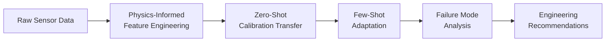
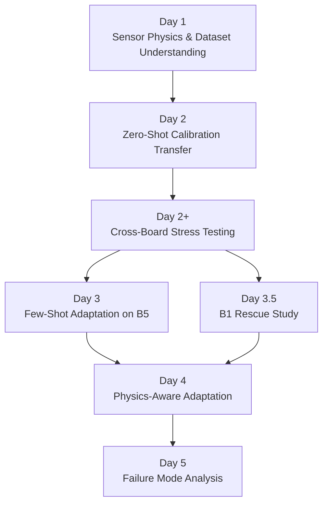

# MOx Calibration Transfer for Combustible Gas Detection

Physics-informed calibration transfer and failure-mode analysis
using the UCI Twin Gas Sensor Arrays dataset.

## Project Report

A detailed technical portfolio report is available here:

📄 [MOx_Calibration_Transfer_Portfolio_Report.pdf](docs/MOx_Calibration_Transfer_Portfolio_Report.pdf)

The report includes:

- Physics-informed feature engineering
- Cross-board transfer analysis
- Few-shot adaptation
- Failure-mode taxonomy
- Sensor-physics interpretation
- Label leakage investigation
- Deployment recommendations

## Research Highlights

> **Not all calibration transfer failures are the same — and the remedy depends on the mechanism.**

| | |
|---|---|
| 🎯 **B5 few-shot recovery** | >80–90% RMSE reduction with a handful of labeled target points |
| ⚠️ **B1 resistance** | Only ~27% RMSE reduction; systematic response compression persists after adaptation |
| ⚛️ **Physics-informed features** | R² = 0.957 vs 0.921 for raw features — same board, same zero-shot conditions |
| 📐 **Simple beats complex** | Global mean/std alignment outperforms physics-aware piecewise corrections at realistic calibration budgets |
| 🔍 **Two failure modes** | Coverage-limited transfer (B5) vs. target-intrinsic compression (B1) — distinct causes, distinct remedies |
| 🧹 **Label leakage caught** | Discovered, diagnosed, and corrected mid-study; corrected results form the basis of all conclusions |

---
## Why This Project Matters

Most calibration transfer studies report whether transfer works.
This project investigates why transfer fails.
The result is a practical failure-mode taxonomy that links machine learning performance to underlying sensor behavior.

---

## Quick Summary

Five independent MOx sensor boards were used to investigate calibration transfer for methane sensing.

The project identified two distinct transfer failure modes:

- Coverage-limited failure (Board B5), highly recoverable with few-shot adaptation.
- Target-intrinsic failure (Board B1), characterized by persistent high-concentration response compression.

Physics-informed features improved zero-shot transfer performance (R² = 0.957 vs 0.921), while simple mean/std alignment consistently outperformed more complex adaptation methods under realistic calibration budgets.

The central finding:

> Not all calibration transfer failures are the same — and the remedy depends on the mechanism.

---

## Project Architecture



---

## Key Results

| Finding | Result |
|---|---|
| B5 few-shot adaptation | RMSE reduced >80–90% with a handful of target calibration points |
| B1 few-shot adaptation | Only ~27% RMSE reduction; response compression persists |
| Physics-informed features | R² = 0.957 vs 0.921 for raw features (Board 5, zero-shot) |
| B5 zero-shot baseline | RMSE = 5.94 ppm, R² = 0.957 (XGBoost, physics features) |
| B1 zero-shot baseline | RMSE ≈ 15.4 ppm; signed error reaches −25 ppm at 100 ppm |
| B5 best few-shot | RMSE ≈ 1–2 ppm, R² > 0.99 (1-shot, mean/std alignment) |
| B1 best few-shot | RMSE ≈ 11.3 ppm (10-shot, RF weighted retraining) |
| Physics-aware correction | Did not consistently outperform simple mean/std alignment |
| Main conclusion | Calibration transfer failures arise from multiple distinct mechanisms |

---

## Visual Results

### Figure 1 — Transfer Failure Emerges on Board B5


*Zero-shot calibration transfer to Board B5 using physics-informed features. XGBoost with Rs/R₀ descriptors achieves R² = 0.957 at zero adaptation cost — establishing the ceiling for source-only transfer.*

---

### Figure 2 — Few-Shot Adaptation Dramatically Reduces B5 Error


*Few-shot adaptation on Board B5: RMSE collapses by >80–90% within the first few labeled target samples. Mean/std alignment (orange) is the dominant strategy — simple, robust, and not outperformed by more complex corrections.*

---

### Figure 3 — B1 and B5 Respond Differently to Adaptation


*B5 is highly recoverable with few-shot adaptation; B1 remains difficult across all methods and sample counts. This divergence motivated a formal mechanistic investigation, confirming two qualitatively distinct failure modes.*

---

### Figure 4 — Failure Mode Taxonomy (Day 5 Synthesis)


*Calibration transfer failures are not a single phenomenon.
Board B5 exhibits a coverage-limited failure mode and is highly recoverable.
Board B1 exhibits a target-intrinsic compression failure mode and remains difficult even after adaptation.*

---

## Overview

Metal oxide (MOx) gas sensors degrade in reproducibility when deployed across multiple physically distinct sensor boards. Even within a single sensor batch, board-to-board variation in baseline resistance, response gain, and recovery dynamics can render a model trained on one board unreliable when applied to another. This is the **calibration transfer problem**.

This project investigates calibration transfer for combustible gas detection (methane focus) using the [UCI Twin Gas Sensor Arrays dataset](https://archive.ics.uci.edu/dataset/361/twin+gas+sensor+arrays), a controlled benchmark with five independent sensor boards and four combustible gases. The work progresses from a zero-shot baseline through few-shot adaptation and physics-aware correction, culminating in a structured failure-mode analysis that distinguishes two qualitatively different transfer failure mechanisms.

The emphasis throughout is on **interpretable methods, scientific rigor, and deployment realism** — not benchmark overfitting.

---
## Scientific Contributions

### 1. Failure-Mode Taxonomy
Coverage-limited (B5) vs Target-intrinsic (B1)

### 2. Physics-Informed Features
Rs/R0 and normalized response improve transfer robustness

### 3. Simple Alignment Beats Complex Methods
Mean/std alignment outperformed more sophisticated corrections under small adaptation budgets

### 4. Scientific Rigor
Label leakage was discovered, diagnosed, and corrected during development

See Portfolio Report for details.

---
## Sensor Physics Background

MOx sensors exhibit board-to-board variability in baseline resistance, gain, heater operating point, and recovery dynamics.

Physics-informed features (Rs/R0, normalized response, baseline-referenced descriptors) reduce nuisance variation and improve calibration transfer robustness.

For a detailed discussion, see the Portfolio Report.

---
## Project Timeline



---

---

## Methods Used

All methods are intentionally lightweight and interpretable.

**Regression:** Ridge, RandomForest, XGBoost

**Feature engineering:** Statistical descriptors (min, max, std, percentiles), physics-informed (Rs/R₀, normalized response, drift-corrected baseline), combined sets

**Domain adaptation:** Mean/std feature alignment, linear recalibration, residual correction, CORAL-style covariance alignment (negative result — documented)

**Few-shot adaptation:** 0-shot through 10-shot calibration using labeled target-board samples

**Manifold analysis:** PCA (board trajectory, manifold overlap, coverage volume)

**Failure mode diagnostics:** Coverage score, gain mismatch score, curvature mismatch score, high-concentration compression score

No deep learning. No UMAP. No large hyperparameter searches. The constraint is intentional: deployment-realistic methods that can be understood, audited, and maintained.

---

## Practical Deployment Implications

1. **Diagnose before remediating.** Apply the Day 5 diagnostic scores to any new target board before selecting an adaptation strategy. Coverage-limited boards respond to few-shot alignment; intrinsically compressed boards require hardware-level intervention.

2. **Start with mean/std alignment** as the few-shot adaptation baseline. It is robust, interpretable, and competitive with more complex methods at realistic calibration budgets (1–10 labeled samples).

3. **Use physics-informed features** as the primary feature representation. Normalized resistance ratios and response-magnitude descriptors are more portable across boards than raw resistance values.

4. **Identify board-invariant feature subsets** (see Day 5 transferability analysis) and prioritize these for field deployment. Features with low board-to-board coefficient of variation reduce recalibration burden.

5. **Treat low-concentration calibration carefully.** Day 4 showed that low-concentration regimes can be as difficult as high-concentration regimes due to lower SNR and stronger baseline drift influence.

---

## Repository Structure

```
mox_calibration_transfer/
│
├── notebooks/                               # Executable research record
│   ├── 01_dataset_understanding.ipynb       # Day 1: sensor physics, board variation
│   ├── 02_baseline_transfer.ipynb           # Day 2: zero-shot cross-board baseline
│   ├── 03_cross_board_transfer_stress_test.ipynb  # Day 2+: all-pairs stress test
│   ├── 04_geometry_analysis.ipynb           # Day 2+: PCA geometry of transfer difficulty
│   ├── 05_manifold_coverage_analysis.ipynb  # Day 2+: coverage metrics
│   ├── 06_target_coverage_control.ipynb     # Day 2+: coverage control
│   ├── 07_B1_failure_analysis.ipynb         # Day 2.5: B1 concentration compression
│   ├── 08_fewshot_adaptation.ipynb          # Day 3: few-shot B5 adaptation
│   ├── 09_B1_fewshot_rescue.ipynb           # Day 3.5: few-shot B1 rescue attempt
│   ├── 10_physics_aware_adaptation.ipynb    # Day 4: physics-aware methods
│   └── 11_failure_mode_analysis.ipynb       # Day 5: B1 vs B5 mechanism comparison
│
├── src/                                     # Reusable Python modules
│   ├── config.py                            # Paths, constants, board/gas definitions
│   ├── parse_twin_gas.py                    # Raw file parser and segmentation
│   ├── features.py                          # Physics-informed feature engineering
│   ├── modeling.py                          # Model training and evaluation utilities
│   ├── day2plus_transfer_matrix.py          # All-pairs transfer stress test
│   ├── day3_adaptation.py                   # Few-shot adaptation methods
│   ├── day4_physics_aware.py                # Physics-aware calibration methods
│   └── day5_failure_mode_analysis.py        # Failure mode diagnostic tools
│
├── figures/                                 # Publication-quality output figures
│   ├── day1/                                # Sensor response visualization
│   ├── day2/                                # Baseline transfer results
│   ├── day2plus/                            # Stress test and geometry analysis
│   ├── day2_5_b1_failure/                   # B1 concentration compression
│   ├── day3/                                # Few-shot adaptation curves
│   ├── Day3_5_B1_adaptation_memory_safe/    # B1 rescue analysis
│   ├── day4/                                # Physics-aware method results
│   └── day5/                               # Failure mode comparison
│
├── results/                                 # Numerical outputs (CSVs, metrics)
│   └── [mirrored day structure]
│
├── data/
│   └── README.md                            # Dataset download instructions
│
├── docs/                                    # Observation notes and interpretation
├── requirements.txt                         # Curated research dependencies
├── LICENSE                                  # MIT
└── .gitignore
```

---

## Where to Start

Recommended reading order for a new reader:

1. This README
2. `docs/observations/` — scientific reasoning, debugging process, negative results
3. `notebooks/11_failure_mode_analysis.ipynb` — the synthesis
4. `figures/day5/` — failure mode comparison visualizations
5. `results/day5/` — quantitative diagnostic outputs

The observation documents contain the full scientific reasoning developed throughout the project, including negative results and mid-study corrections.

---

## Dataset

This project uses the UCI Twin Gas Sensor Arrays dataset (ID #361).

**Raw data is not included in this repository.** See [`data/README.md`](data/README.md) for download instructions.

**Citation:**
> Fonollosa, J., Fernández, L., Gutiérrez-Gálvez, A., Huerta, R., & Marco, S. (2015).
> Calibration transfer and drift counteraction in chemical sensor arrays using Direct Standardization.
> *Sensors and Actuators B: Chemical*, 236, 1044–1053.
> https://doi.org/10.1016/j.snb.2016.05.089

The dataset is made available under CC BY 4.0 by its original authors.

---

## Getting Started

```bash
# 1. Clone the repository
git clone https://github.com/<your-username>/mox_calibration_transfer.git
cd mox_calibration_transfer

# 2. Create a virtual environment
python -m venv .venv
source .venv/bin/activate        # Windows: .venv\Scripts\activate

# 3. Install dependencies
pip install -r requirements.txt

# 4. Download the dataset
# See data/README.md for instructions — place files in data/raw/

# 5. Launch notebooks
jupyter lab
# Start with: notebooks/01_dataset_understanding.ipynb
```

Python 3.10 or later is required.

---

## Project Status

All experimental work is complete.

| Phase | Status |
|---|---|
| Day 1 — Dataset Understanding | ✓ Complete |
| Day 2 — Baseline Transfer | ✓ Complete |
| Day 2+ — Cross-Board Stress Testing | ✓ Complete |
| Day 2.5 — B1 Failure Analysis | ✓ Complete |
| Day 3 — Few-Shot Adaptation | ✓ Complete |
| Day 3.5 — B1 Rescue Study | ✓ Complete |
| Day 4 — Physics-Aware Adaptation | ✓ Complete |
| Day 5 — Failure Mode Analysis | ✓ Complete |

---

## License

This project is licensed under the MIT License. See [LICENSE](LICENSE) for details.
